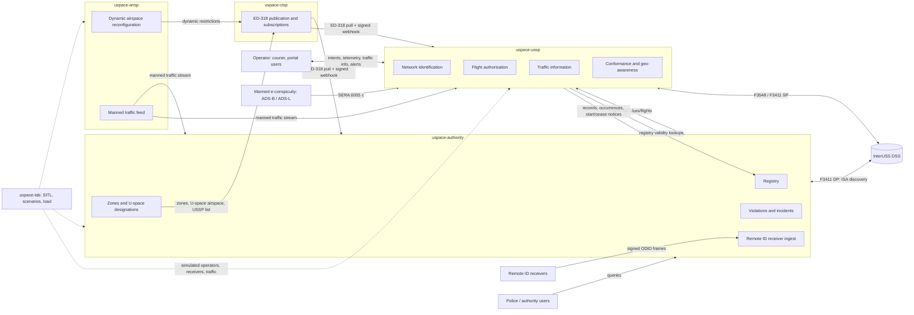

# 00 — Overview

Status: draft for owner review, audited against the primary sources (see `09-conformance.md` for the matrix, the national choices and what remains unverified). Companion files: `01` roles, `02` interfaces, `03` data, `04` messages, `05` scale, `06` security, `07` roadmap, `08` open questions, `09` conformance.

Citation rule: article and paragraph numbers of 2021/664, 2021/665, 2021/666, 2019/947, 2019/945 (as amended by 2020/1058) and 376/2014 were re-read from the published texts. Anything marked *(unverified)* could not be re-read and must be confirmed before it is relied on.

## 1. Purpose and scope

A clean-sheet rebuild of the Georgian national drone traffic system on the EU U-space model, as five independently deployable systems plus one external operator. Each system is one repository, one database pair, one published API, one web UI and one deployment, a Go backend of a few processes sharing one domain layer plus a Next.js UI (`§6`); systems talk only through standard or published APIs. The predecessor (`rootxkit/utm`, a single monitoring system) is the knowledge source, not the code base; its safety behaviour is pinned by the vectors in `knowledge/vectors/`.

In scope: regulation-mapped responsibilities, interfaces, data and message contracts, scale and reliability design, security, build order. Out of scope: a full ATM system, command of any aircraft, UAS onboard software, payment or billing.

Two invariants carry over from the predecessor unchanged:

| Invariant | Meaning |
|---|---|
| No system ever commands an aircraft | Authorisation, geo-awareness, conformance and traffic information act on operators and remote pilots. No service has a send path to a vehicle. |
| Every safety-relevant behaviour is observable in SITL before it is done | `uspace-lab` holds the simulators and scenarios; its simulators never ship. |

## 2. The EU model in brief

Two regulatory layers, both from the Basic Regulation (EU) 2018/1139:

| Layer | Applies | What it brings | Primary source |
|---|---|---|---|
| UAS operations | everywhere | Open / specific / certified categories (Art. 3–6), 120 m from the closest point of the surface in open (UAS.OPEN.010(2)), remote pilot competency (Art. 8, UAS.OPEN.020/030/040), operator registration (Art. 14), geographical zones (Art. 15), competent authority tasks (Art. 18), operator occurrence reporting (Art. 19(2) → 376/2014). Product rules, class marks C0–C6 and direct Remote ID in 2019/945 as amended by 2020/1058. | Reg. (EU) 2019/947, 2019/945 ([EASA Easy Access Rules UAS](https://www.easa.europa.eu/en/document-library/easy-access-rules/easy-access-rules-unmanned-aircraft-systems-regulations-eu-2019947-and-eu-2019945)) |
| U-space | only inside designated U-space airspace; A1 flights with C0 or privately built < 250 g UA and IFR flights are out of its scope (Art. 1(3)) | Mandatory services (Art. 3(2)): network identification (Art. 8), geo-awareness (Art. 9), UAS flight authorisation (Art. 10), traffic information (Art. 11). Optional per airspace (Art. 3(3)): weather (Art. 12), conformance monitoring (Art. 13). Per-airspace requirements (Art. 3(4), Annex I), registry access for USSPs (Art. 3(5)), dynamic reconfiguration (Art. 4), common information services (Art. 5, Annex II–III), operator duties (Art. 6), USSP duties (Art. 7, Annex V), certification (Art. 14–16, Annex VI–VII), competent authority (Art. 17–18). Applicable since 26 Jan 2023. | Reg. (EU) 2021/664 ([EUR-Lex](https://eur-lex.europa.eu/legal-content/EN/TXT/?uri=CELEX:32021R0664), [EASA Easy Access Rules U-space](https://www.easa.europa.eu/en/document-library/easy-access-rules/online-publications/easy-access-rules-u-space)); 2021/665 (adds ATS.OR.127 coordination and ATS.TR.237 dynamic reconfiguration to 2017/373); 2021/666 (SERA.6005(c): manned aircraft in U-space airspace not under ATC make themselves electronically conspicuous to USSPs; SERA.6005(d): the airspace is promulgated in the AIP) |

Annexes of 2021/664 (re-read): I criteria for UAS capabilities, service performance and operational conditions per U-space airspace; II common information online through common open, secure, scalable technologies, non-discriminatory, common secure interoperable open protocol; III data quality (verification, metadata, authenticated transfer, error reporting) and protection (encryption, security risk management, insider risk) — it sets **no numeric latency**; the latency and performance figures are the Member State's determination under Art. 3(4)(b); IV the ten items of a flight authorisation request; V the USSP–ATS exchange (service level agreement, exchange model with extension mechanism, recognised encryption, open protocol); VI–VII certificate forms.

Standards chosen to implement the open protocols the regulation requires but does not name (a national/ecosystem choice, `09 §2`): ASTM F3411-22a for network identification (SP, DP, DSS, ISA), ASTM F3548-21 for flight authorisation interoperability (operational intents, constraints, DSS), EUROCAE ED-318 for geo-zone and U-space data provision, ASD-STAN EN 4709-002 / ASTM F3411 broadcast for direct Remote ID.

Georgia: GCAA's UAS rules in force since 2021-01-01 mirror 2019/947 (open/specific/certified, 120 m, operator registration, direct Remote ID for C1–C3) per [uas.gov.ge](https://uas.gov.ge/EN); zones are shown on [airspace.gov.ge](https://airspace.gov.ge/) with no machine-readable feed. Whether 2021/664 is adopted and any U-space airspace designated is **unverified** (`08-open-questions.md` Q1–Q2). The system is built so that the 2019/947 layer works on day one and the 2021/664 layer activates per designated volume.

## 3. The five systems and the operator

| Code name | Role | Regulation | Owner of truth for |
|---|---|---|---|
| `uspace-authority` | Competent authority (GCAA; branding is configuration) | 2019/947 Art. 14, 15, 17, 18; 2021/664 Art. 3, 5(1), 14–18; 376/2014 Art. 6(3), 6(6) | Registry (operators, UAS, pilots), geo-zones, U-space airspace designations and their Art. 3(4) requirements, USSP/CISP certificates and register (Art. 18(a)), violations, occurrences, Remote ID receiver network, audit of oversight; F3411 Display Provider for its own picture |
| `uspace-cisp` | Single Common Information Service Provider (Art. 5(6)); state-run — decided by the owner, a choice the regulation allows; a third-party CISP must be able to replace it behind the same ED-318 and OpenAPI contracts (`§7`) | 2021/664 Art. 5, Annex II–III; ED-318 | The published, versioned common information picture: zones, U-space airspaces with requirements and adjacency, dynamic restrictions, ATS operational data, USSP list and terms, publication history |
| `uspace-ussp` | U-space Service Provider | 2021/664 Art. 7–13, 15, Annex III–V; F3411, F3548 | Operational intents and authorisations (with authorisation numbers and deviation thresholds), network identification of its flights, conformance state, traffic information issued, service records (≥ 30 days, Art. 15(1)(g)) |
| `uspace-ansp` | ANSP's U-space interface (not an ATM system) | 2021/665 (ATS.OR.127, ATS.TR.237); 2021/664 Art. 4, 5(2), 7(3), Annex V | Dynamic airspace reconfigurations, manned traffic feed as handed to U-space, coordination messages |
| `uspace-lab` | Integration, SITL, scenarios, load tests, demo | — | Nothing in production; test vectors, scenarios, load reports |
| `courier` (external) | UAS operator; a USSP client later | 2021/664 Art. 6 | Its own fleet and missions |

## 4. Context diagram

Solid arrows are production interfaces (`02-interfaces.md`); dotted arrows exist only in the lab.

## 5. Glossary

| Term | Definition here |
|---|---|
| Authority | The competent authority of 2019/947 Art. 17 / 2021/664 Art. 17: GCAA. Registers, designates, certifies, oversees, records incidents. Does not provide U-space services. |
| CISP | Common Information Service Provider (2021/664 Art. 2(4), Art. 5): makes the common information of Art. 5(1)–(3) available per Annex II–III to authorities, ATS providers, USSPs and UAS operators on a non-discriminatory basis (Art. 5(5)). A member state may designate a single CISP on an exclusive basis (Art. 5(6)); it must then be certified under Chapter V (Art. 5(7)). Here it is state-run (decided; a choice the regulation allows); the DSS hosted beside it remains a national choice. |
| ANSP | Air navigation service provider; here the ATS provider of 2021/665: ATS.OR.127 (manned traffic information for U-space airspace in controlled airspace, coordination procedures with USSPs and the CISP) and ATS.TR.237 (dynamic reconfiguration by ATC units, notification of activation, deactivation and temporary limitations to USSPs and the CISP); Annex V exchange. |
| USSP | U-space Service Provider (Art. 7): a certified legal person providing the U-space services to UAS operators; an operator may be its own USSP (Art. 6(2)). |
| DSS | Discovery and Synchronisation Service: the ASTM F3548 / F3411 broker through which USSPs discover each other's operational intents, constraints and identification service areas. Reference implementation: [InterUSS DSS](https://github.com/interuss/dss). |
| Operator | UAS operator (2019/947 Art. 2): the legal or natural person operating UAS, registered under Art. 14, holder of the registration number. |
| Remote pilot | The natural person flying the UAS (2019/947 Art. 2), holder of competency proof (A1/A3, A2, STS). |
| UAS | Unmanned aircraft system: the aircraft plus its remote control equipment (2019/947 Art. 2). Identified by manufacturer serial (ANSI/CTA-2063-A) and, for class-marked UAS, class label. |
| Direct Remote ID | Broadcast identification (2019/945 as amended by 2020/1058: Parts 2–4 point (12) for C1–C3, Part 6 for the add-on; ASD-STAN EN 4709-002; ASTM F3411 broadcast). Content for class-marked UA: operator registration number (with the verification code, see `06 §5`), serial (ANSI/CTA-2063-A), time stamp, position, height above surface or take-off point, course, ground speed, remote pilot position or take-off point, emergency status. The add-on list (Part 6) has no emergency status. Over Bluetooth or Wi-Fi, open and documented protocol, unauthenticated. |
| Network Remote ID | Identification over the internet (ASTM F3411-22a network): a Net-RID Service Provider serves `/uss/flights` and `/uss/flights/{id}/details` for the ISAs it registers in the DSS; a Display Provider discovers ISAs through the DSS and pulls from the Service Providers. In U-space it is the network identification service of 2021/664 Art. 8; the authority is a standard Display Provider. |
| Operational intent | ASTM F3548-21 term for a declared flight volume set in 4D with a DSS state (`Accepted`, `Activated`, `Nonconforming`, `Contingent`). The carrier of a 2021/664 Art. 10 flight authorisation request and its result; the authorisation itself is the USSP's decision with a unique authorisation number (Art. 10(11)) and deviation thresholds (Art. 10(2)(d)). |
| Geo-zone | UAS geographical zone (2019/947 Art. 15): a volume that facilitates, restricts or excludes UAS operations, published with its period of validity in a common unique digital format (Art. 15(3), Art. 18(f)); encoded per EUROCAE ED-318 `UASZone` with type `PROHIBITED`, `REQ_AUTHORIZATION`, `CONDITIONAL`, `NO_RESTRICTION`, `USPACE` (ED-269 names the same set `restriction`, spelled `REQ_AUTHORISATION`). |
| U-space airspace | A geographical zone designated by the member state where UAS may operate only with U-space services (2021/664 Art. 2(1), Art. 3), with the UAS capability, service performance and operational requirements of Art. 3(4). |
| Dynamic airspace reconfiguration | Temporary modification of U-space airspace limits by ATC units to accommodate manned traffic (2021/664 Art. 2(6), Art. 4; ATS.TR.237). |
| Conformance | Whether a flight stays within its authorisation, its deviation thresholds and the Art. 6(1) requirements (2021/664 Art. 13(1); F3548 conformance states). Height conformance is part of it; the authorised upper limit never exceeds the applicable zone or airspace ceiling, so a height constraint set under Art. 3(4)(c) is covered. |
| Occurrence | An event reportable under Reg. (EU) 376/2014 Art. 4 (mandatory, categories of Art. 4(1), within 72 h of awareness: Art. 4(7)–(8)) or Art. 5 (voluntary); airprox is one. UAS-specific occurrence classes are in 2015/1018 *(annex not re-read; unverified)*. Occurrence information may be used only for safety (Art. 15(2)) and never to attribute blame (Art. 16(6)–(7)). |
| Violation | The authority's finding, from its own evidence, that a rule was broken (height, zone, unregistered aircraft, no authorisation); 2019/947 Art. 18(a), (k). Distinct from a USSP alert (a service to the operator) and from an occurrence report (protected by 376/2014). |

## 6. Technology

**Rule.** Go is the entire backend of every system: hot path and control plane alike — ingest, engines, APIs, registry, registration, the occurrence and incident workflow, the authorisation request API, admin, token service, and all of `uspace-cisp`. Next.js (React, TypeScript) for every web UI, public and internal; Next.js only renders — its API routes are at most a BFF / auth-cookie layer, never business logic, never a database or NATS client. Data: PostgreSQL + PostGIS, TimescaleDB, NATS JetStream. Python only for SITL tooling and vector generation in `uspace-lab`. The code is written by the owner and Claude; one backend language keeps every judgement, every migration and every test in one place.

**Hard rule.** Safety logic — identification resolution, zone judging (horizontal, vertical, time applicability), CPA, conformance, strategic deconfliction, and the time placement, pressure-altitude and geodesy rules they rest on — exists **once**, in Go packages, pinned by the knowledge vectors in `knowledge/vectors/` (`identification_status`, `rid_identity`, `zones_applicability`, `zones_vertical`, `cpa`, `alert_lifecycle`, `pressure_altitude`, `terrain_geoid`, `geodesy`, `rid_time`, `odid_decode`, `ed269_parse`, `fleet_match`, `serials_and_registration`, `source_control`, `rid_receiver_auth`). Every process that needs a judgement imports the package; nothing re-implements it, in Go or in TypeScript. CI runs the vectors against the packages on every change; a Next.js file importing geometry or geodesy libraries fails lint.

### 6.1 Per-system decomposition (Go services and Next.js UI)

Each system is one Go module with one `internal/` domain layer shared by all of its processes, and several binaries under `cmd/`. Processes are split only where independent scaling or failure isolation matters; a shared package is preferred to an internal network hop. NATS is used where it decouples processes (fan-out, work queues, projections), never to call a function that the same binary could import.

| System | Go processes (`cmd/`) | Shared `internal/` packages | Next.js UI (`web/`) |
|---|---|---|---|
| authority | `api` (registry, certificates and register, zones authoring and CISP publication, occurrences and incidents, evidence, police realm, sources, audit, token service and JWKS, violations review); `rid-ingest` (F9 receivers, ODID decode, time placement); `dp-poller` (F3411 Display Provider: ISA discovery, SP polls, 24 h cache); `manned-ingest` (F4); `detect` (identification, zone and 120 m violation detectors, partitioned per `cell3`); `tsdb-writer`; `picture-ws` (live console feed by viewport) | `registry`, `zones` (ED-318 model, applicability, vertical judging), `identify`, `cpa`, `terrain`, `geoid`, `timeplace`, `odid`, `policy`, `sources`, `occurrence`, `auth` (JWT issue and verify), `store` (PostgreSQL, TimescaleDB) | public: registration-number check, rules; internal: inspector console (map from `picture-ws`), registry, certificates, occurrences, sources, audit |
| cisp | `api` (publications, versions, diffs, restrictions lifecycle, ED-318 reads from a materialised current-version table with `ETag` and cache headers, change feed, subscriptions, public read API, WS change stream); `deliver` (webhook fan-out with retry, JetStream work queue) | `publication`, `ed318`, `subscription`, `auth`, `store` | public zone map; publications and deliveries console |
| ussp | `api` (operator accounts and OAuth2 clients, OIDC, the flight-authorisation request API: Annex IV intake, registry check, deconfliction, DSS write, decision record and authorisation number; geo-awareness; records; occurrences; weather; F3548 USS endpoints; alert acknowledgements); `telemetry-ingest` (F5 WS and batch, serial binding, F3411 ISA upkeep); `rid-sp` (F3411 `/uss/flights`, details); `monitor` (conformance, CPA / traffic information, geo-awareness evaluation, alert state machine; partitioned per `cell3`); `traffic-ws` (traffic stream and alerts to operators); `dss-sync` (subscriptions, peer notifications, constraint intake, availability); `tsdb-writer` | `intent` (Annex IV, deconfliction, priority), `dss` (F3548 / F3411 clients), `zones`, `cpa`, `conformance`, `identify`, `terrain`, `geoid`, `timeplace`, `policy`, `auth`, `store` | operator portal (public); USSP admin / supervisor console |
| ansp | `api` (restrictions lifecycle, CISP publication, DSS constraints, restriction requests, coordination inbox and acknowledgements, adapter status); `manned-adapter` (ADS-B / ASTERIX / ATM feed → `track/manned/v1`, one per adapter instance); `manned-feed` (the F4 stream and snapshot over the union of the adapters) | `restriction`, `manned`, `dss`, `auth`, `store` | dispatcher console |
| lab | SITL bridges (MAVLink → telemetry, MAVLink → ODID), simulated peer USSP and DP, receiver and ANSP simulators, load generators, vector runner | imports the other systems' packages only through their public APIs — never their `internal/` | results dashboard |

Where the same package appears in two systems, it lives once in the shared Go module `rootxkit/uspace-core` (`§6.3`), compiled into each system's binaries at build time and pinned by a semver tag; it is the module the vectors pin. A system never forks it.

### 6.2 Process boundaries and the UI

| Boundary | Mechanism | Rule |
|---|---|---|
| hot-path process → control-plane process (events: violations, identification changes, conformance states, flight start / end, alerts needing records) | JetStream subjects of `05 §3`, explicit ack | the API process persists and opens workflow; it never re-judges — it has no reason to, the judgement came from the same package |
| control-plane → hot-path (registry validity, zone versions, policy, source switches, client / serial bindings) | NATS KV buckets written by `api`, read as in-memory projections by the hot-path processes, refreshed by push plus periodic re-read | hot-path processes never open PostgreSQL; a stale projection is served with age, never blocks |
| synchronous judgement from the API (deconfliction on intent create / modify / activate, identity for evidence review, zone judging for evidence packs) | a direct call into `internal/intent`, `internal/identify`, `internal/zones` inside the `api` process | no network hop; the DSS write that deconfliction needs is the only remote call |
| `web` → backend | HTTPS to `api` and the WS processes on the same origin; the BFF route exchanges the login for an `HttpOnly`, `SameSite=Strict` cookie holding the session JWT and forwards it as a bearer | `web` holds no credentials in browser code, no database, no NATS |
| TypeScript types | generated from the JSON Schemas and the OpenAPI files (Go → TypeScript only, `openapi-typescript`, `json-schema-to-typescript`) for the Next.js clients | hand-written types for a server message are a lint failure |

**JWT.** Every token (ecosystem, operator, console session) is an RS256 JWT with `iss`, `aud`, `sub`, `scope`, `exp`, `jti`, `kid`, issued by the authority's token service (ecosystem, console) or the USSP's issuer (operators), and verified by one Go package (`uspace-core/auth`, on `lestrrat-go/jwx`): JWKS from `/.well-known/jwks.json` of an allow-listed `iss`, cached 24 h, key by `kid`, RS256 only, `exp` with ≤ 30 s skew, `aud` = own system id, endpoint scope. The Next.js BFF never verifies tokens; it carries the cookie. Internal NATS traffic carries no JWT: the NATS cluster is per system on an isolated network with per-process NATS credentials.

### 6.3 Shared libraries (separate repositories, already created)

**`rootxkit/uspace-core`** — a Go module. A library, not a service: no process, no port, no database; compiled into each system's binaries at build time and pinned by a semver tag in each system's `go.mod`.

| Package | Content | Vectors that pin it |
|---|---|---|
| `core` | shared base types: positions, altitudes and their sources, times, identification statuses and reasons, zone types, severities, field errors, counters | (through every package below) |
| `odid` | ODID / Remote ID message types (Basic ID, Location, System, Operator ID, Self-ID, Authentication, Message Pack), decode and encode for BT4/BT5/Wi-Fi frames, special-value handling | `odid_decode` |
| `rid` | Remote ID observation rules above the codec: Basic ID and Location joined per transmitter address, freshness, unidentified tracks, anomalies; geodetic or pressure altitude with its hold | `rid_identity`, `pressure_altitude` |
| `timeplace` | `ts` / `rx_ts` / `captured_at` / `backlog` placement, Remote ID hour reconstruction and broadcast time tolerance, network Remote ID placement, source clock skew | `rid_time` |
| `geodesy` | WGS84 distance, bearing, points in circles and polygons, projection to local metres, H3 helpers | `geodesy` |
| `terrain`, `geoid` | DEM and EGM2008 readers (Copernicus GLO-30 / SRTM tiles, 2.5′ geoid grid), HAE ↔ AMSL, AGL where ground known | `terrain_geoid` |
| `ed269` | ED-269 zone model, strict GeoJSON parse, validate and export, applicability (TimePeriod, DailyPeriod, daylight events) | `ed269_parse`, `zones_applicability` |
| `ed318`, `f3411`, `f3548` | the ED-318 UASZone model and the ED-269 → ED-318 mapping; the `uas_standards` types for F3411 v22a and F3548 v21, scopes, constants, DSS and USS client/server helpers | schema examples |
| `regnum`, `serial` | registration number (public part, secret part hash, checksum when adopted) and ANSI/CTA-2063-A serial validation, normalisation and fold key | `serials_and_registration` |
| `identify` | identification status and reason resolution, `serial_conflict` rule, basis (authenticated / as broadcast), the spoofing guard (`fleet_match`) | `identification_status`, `fleet_match` |
| `zones` | zone judgement: horizontal containment, vertical references (AGL / AMSL / WGS84), pressure-altitude margin and `within_band`, height limit, applicability at `captured_at`, zone index | `zones_vertical` |
| `cpa` | closest point of approach, loss of separation over the window, neighbour grid | `cpa` |
| `alerting` | the alert state machine of a monitor: admission, raise, refresh, hysteresis, clear reasons, the aircraft cap | `alert_lifecycle` |
| `auth` | JWT / JWKS verification (`§6.2`), scope checks, token issuance helpers; Remote ID receiver HMAC signatures | `jwt_verify`, `rid_receiver_auth` |
| `sources` | source-control model (type / instance switches, version and epoch) | `source_control` |
| `vectors` | the test harness: the knowledge vectors vendored from `uspace-lab/knowledge/vectors/` at a pinned commit (`VERSION`, `SHA256SUMS`, checked against the lab in CI), run as `go test` against every package in `uspace-core`; a system runs the cases that name it (`RunOwned`) against its own adapters, never a second copy of the judgement | all |

Versioning and compatibility: semver tags `vMAJOR.MINOR.PATCH`; within a major, only additive changes (new functions, new optional fields, new vector cases that existing behaviour already passes); a behavioural change to a judgement is a **major** even if the Go signature is unchanged, and ships with the changed vector and a `CHANGELOG` entry naming the regulation or standard clause behind it; two majors are maintained in parallel for six months. Each system upgrades on its own schedule by bumping the tag; a system on an old major still passes the vectors of that major. `uspace-core` depends on nothing from the systems; the systems never import each other.

**`rootxkit/uspace-ui`** — an npm package for the Next.js apps (stack: Next.js, shadcn/ui on Tailwind and Radix). Content: the shadcn/ui theme and design tokens (one visual language across public and internal apps; branding values injected by configuration), the MapLibre map components (viewport, tile sources, bbox subscription hooks), track and zone legends and symbology (trust class, identification status, age, zone type, restriction state), `ka` / `en` i18n with a Georgian-capable font (Noto Sans Georgian) and message catalogues, and the auth / session helpers for the BFF (cookie exchange, CSRF, token forwarding). Semver, pinned by each `web/`; additive within a major. It contains no business logic and no judgement: it renders what the API says.

## 7. Interoperability with third-party systems

Other organisations may implement their own USSP or CISP, in any language. No system here may assume that the USSP or the CISP on the other side of an interface is ours.

| Rule | Meaning |
|---|---|
| Standards first | Every USSP ↔ USSP, USSP ↔ DSS, DP ↔ SP and CIS interface is the standard one (F3548, F3411, ED-318). A national API exists only where the regulation requires something the standards do not carry (`02 F7`, `F8`, `F11`, the token service). |
| National API publication | Every non-standard national API — registry validity lookups, records, occurrence submission, certificate operating status, the token service and JWKS, the CISP publication API, the ANSP coordination inbox, the optional flight push — is published as versioned OpenAPI 3.1. Each system repo owns its `api/openapi.yaml`; `uspace-lab/api/` aggregates them with a generated index and the TypeScript and Go clients. An endpoint that is not in the OpenAPI file does not exist. |
| Discovery, not configuration | The authority discovers USSPs through the DSS (ISAs, operational intent references, `uss_base_url`) and through the USSP list in the CIS (`02 F1`), never by a configured address of our own USSP. A USSP discovers peers through the DSS and the CISP through the U-space airspace designation in the CIS, never by a hard-wired hostname. The only configured addresses are the DSS, the CISP of record and the authority's token service, and those are per deployment, never in code. |
| Conformance suite (`uspace-lab/conformance/`) | InterUSS `uss_qualifier` for F3411 (SP, DP) and F3548 (strategic coordination, constraints) run against the system under test with the lab DSS; our own tests for the national OpenAPI contracts (from the aggregated files) and for ED-318 publication (schema, vertical references, applicability, versioning, change feed); a documented onboarding procedure: a third-party USSP or CISP runs the suite against the staging DSS and CISP, submits the signed report, and passes before it is admitted to the USSP list — proposed to GCAA as a condition of certification under 2021/664 Art. 15(1)(a)–(b) (**national choice**). Our own systems pass the same suite on every release. |
| Compatibility policy | Additive changes only within a major version of any national API or message (`04 §4`): new optional fields, new endpoints, new enum values that consumers may ignore. A breaking change is a new major, served in parallel for a deprecation window of at least 12 months, announced in the CIS USSP terms and the OpenAPI `deprecated` markers, with the sunset date in a `Sunset` header. Standard versions (F3411 v22a, F3548 v21, ED-318) are pinned per deployment and changed as a major. |

## Errata

| Date | Where | Change | Source |
|---|---|---|---|
| 2026-10-02 | §6.1, `ansp` row | Three processes, not two: `manned-feed` serves F4 over the union of the per-feed adapters (one adapter per feed, LESSONS B-16). The message name is `track/manned/v1`, as `04 §3` catalogues it, not `manned_track.v1`. | `docs/decisions/2026-10-02-cross-plan.md` §1.1 (note after M13), ansp D1 |
