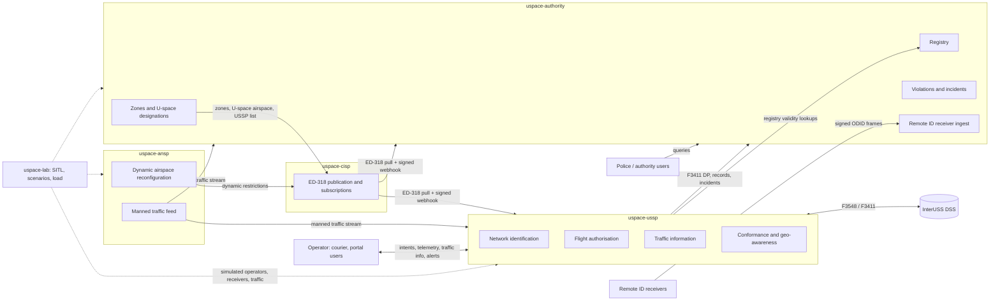

# 00 — Overview

Status: draft for owner review. Companion files: `01` roles, `02` interfaces, `03` data, `04` messages, `05` scale, `06` security, `07` roadmap, `08` open questions.

## 1. Purpose and scope

A clean-sheet rebuild of the Georgian national drone traffic system on the EU U-space model, as five independently deployable systems plus one external operator. Each system is one repository, one database, one API, one console and one deployment; they talk only through standard or published APIs. The predecessor (`rootxkit/utm`, a single monitoring system) is the knowledge source, not the code base.

In scope: regulation-mapped responsibilities, interfaces, data and message contracts, scale and reliability design, security, build order. Out of scope: a full ATM system, command of any aircraft, UAS onboard software, payment or billing.

Two invariants carry over from the predecessor unchanged:

| Invariant | Meaning |
|---|---|
| No system ever commands an aircraft | Authorisation, geo-awareness, conformance and traffic information act on operators and remote pilots. No service has a send path to a vehicle. |
| Every safety-relevant behaviour is observable in SITL before it is done | `uspace-lab` holds the simulators and scenarios; its simulators never ship. |

## 2. The EU model in brief

Two regulatory layers, both from the Basic Regulation (EU) 2018/1139:

| Layer | Applies | What it brings | Primary source |
|---|---|---|---|
| UAS operations | everywhere | Open / specific / certified categories, 120 m height limit in open (UAS.OPEN.010), operator registration (Art. 14), geographical zones (Art. 15), competent authority tasks (Art. 18). Product rules, class marks C0–C6 and direct Remote ID in 2019/945. | Reg. (EU) 2019/947, 2019/945 ([EASA Easy Access Rules UAS](https://www.easa.europa.eu/en/document-library/easy-access-rules/easy-access-rules-unmanned-aircraft-systems-regulations-eu-2019947-and-eu-2019945)) |
| U-space | only inside designated U-space airspace | Mandatory services: network identification (Art. 8), geo-awareness (Art. 9), UAS flight authorisation (Art. 10), traffic information (Art. 11). Optional: weather (Art. 12), conformance monitoring (Art. 13). Common information services (Art. 5), USSP and CISP certification (Art. 14–16), competent authority (Art. 17–18). Applicable since 26 Jan 2023. | Reg. (EU) 2021/664 ([EUR-Lex](https://eur-lex.europa.eu/legal-content/EN/TXT/?uri=CELEX:32021R0664), [EASA Easy Access Rules U-space](https://www.easa.europa.eu/en/document-library/easy-access-rules/online-publications/easy-access-rules-u-space)); 2021/665 (ATS providers: dynamic airspace reconfiguration); 2021/666 (e-conspicuity of manned aircraft in U-space airspace outside controlled airspace) |

Annexes of 2021/664 as the EASA Easy Access Rules list them: I criteria for U-space airspace; II publication of common information; III data quality, latency and protection; IV flight authorisation request; V exchange of operational data between USSPs and ATS providers; VI–VII certificates.

Georgia: GCAA's UAS rules in force since 2021-01-01 mirror 2019/947 (open/specific/certified, 120 m, operator registration, direct Remote ID for C1–C3) per [uas.gov.ge](https://uas.gov.ge/EN); zones are shown on [airspace.gov.ge](https://airspace.gov.ge/) with no machine-readable feed. Whether 2021/664 is adopted and any U-space airspace designated is **unverified** (`08-open-questions.md` Q1–Q2). The system is built so that the 2019/947 layer works on day one and the 2021/664 layer activates per designated volume.

## 3. The five systems and the operator

| Code name | Role | Regulation | Owner of truth for |
|---|---|---|---|
| `uspace-authority` | Competent authority (GCAA; branding is configuration) | 2019/947 Art. 14, 15, 18; 2021/664 Art. 3, 17, 18; 376/2014 | Registry (operators, UAS, pilots), geo-zones, U-space airspace designations, USSP/CISP certificates, violations, incidents, Remote ID receiver network, audit of oversight |
| `uspace-cisp` | Common Information Service Provider | 2021/664 Art. 5, Annex II; ED-318 | The published, versioned common information picture: zones, U-space airspaces, dynamic restrictions, USSP list, publication history |
| `uspace-ussp` | U-space Service Provider | 2021/664 Art. 7–13, Annex III–V; F3411, F3548 | Operational intents and authorisations, network identification of its flights, conformance state, traffic information issued, service records |
| `uspace-ansp` | ANSP's U-space interface (not an ATM system) | 2021/665; 2021/664 Art. 4, Annex V | Dynamic airspace reconfigurations, manned traffic feed as handed to U-space, coordination messages |
| `uspace-lab` | Integration, SITL, scenarios, load tests, demo | — | Nothing in production; test vectors, scenarios, load reports |
| `courier` (external) | UAS operator; a USSP client later | 2021/664 Art. 6 | Its own fleet and missions |

## 4. Context diagram

Solid arrows are production interfaces (`02-interfaces.md`); dotted arrows exist only in the lab.

## 5. Glossary

| Term | Definition here |
|---|---|
| Authority | The competent authority of 2019/947 Art. 17 / 2021/664 Art. 17: GCAA. Registers, designates, certifies, oversees, records incidents. Does not provide U-space services. |
| CISP | Common Information Service Provider (2021/664 Art. 2, Art. 5): publishes the common information of Annex II to USSPs, the authority, ATS providers and the public. A member state may designate a single CISP per U-space airspace (Art. 5(6), paragraph number unverified against the consolidated text); it may be the state itself. |
| ANSP | Air navigation service provider; here the ATS provider of 2021/665 whose U-space duties are dynamic airspace reconfiguration and coordination data (Annex V). |
| USSP | U-space Service Provider (Art. 7): a certified legal person providing the U-space services to UAS operators. |
| DSS | Discovery and Synchronisation Service: the ASTM F3548 / F3411 broker through which USSPs discover each other's operational intents, constraints and identification service areas. Reference implementation: [InterUSS DSS](https://github.com/interuss/dss). |
| Operator | UAS operator (2019/947 Art. 2): the legal or natural person operating UAS, registered under Art. 14, holder of the registration number. |
| Remote pilot | The natural person flying the UAS (2019/947 Art. 2), holder of competency proof (A1/A3, A2, STS). |
| UAS | Unmanned aircraft system: the aircraft plus its remote control equipment (2019/947 Art. 2). Identified by manufacturer serial (ANSI/CTA-2063-A) and, for class-marked UAS, class label. |
| Direct Remote ID | Broadcast identification (2019/945 Part 6; ASD-STAN EN 4709-002; ASTM F3411 broadcast): operator registration number, serial, position, height, velocity, take-off point, time, emergency status, over Bluetooth or Wi-Fi. Unauthenticated. |
| Network Remote ID | Identification over the internet (ASTM F3411 network): a Net-RID Service Provider serves `/uss/flights`; a Display Provider aggregates. In U-space it is the network identification service of 2021/664 Art. 8. |
| Operational intent | ASTM F3548 term for a declared flight volume set in 4D with a state (Accepted, Activated, Nonconforming, Contingent). The carrier of a 2021/664 Art. 10 flight authorisation request and its result. |
| Geo-zone | UAS geographical zone (2019/947 Art. 15): a volume that facilitates, restricts or excludes UAS operations; encoded per EUROCAE ED-269 / ED-318 with type PROHIBITED, REQ_AUTHORIZATION, CONDITIONAL, NO_RESTRICTION, USPACE. |
| U-space airspace | A geographical zone designated by the member state where UAS may operate only with U-space services (2021/664 Art. 2, Art. 3). |
| Dynamic airspace reconfiguration | Temporary modification of U-space airspace limits by the ATS provider to accommodate manned traffic (2021/664 Art. 4; 2021/665). |
| Conformance | Whether a flight stays within its authorised volumes and times (2021/664 Art. 13, F3548 conformance states). Height conformance is part of it. |
| Airprox | A situation in which the distance between aircraft and their relative positions and speeds were such that safety may have been compromised; a reportable occurrence under Reg. (EU) 376/2014 and 2015/1018, reported within 72 h. |
| Violation | The authority's finding that a rule was broken (height, zone, unregistered aircraft, no authorisation). Distinct from a USSP alert, which is a service to the operator. |
