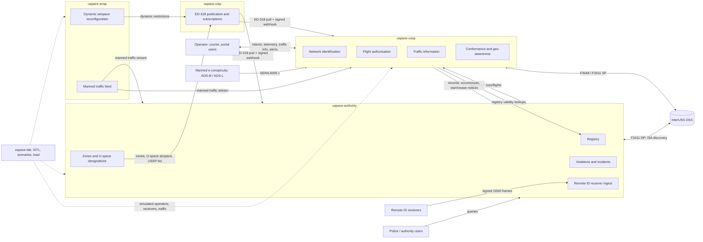

# 00 — Overview

Status: draft for owner review, audited against the primary sources (see `09-conformance.md` for the matrix, the national choices and what remains unverified). Companion files: `01` roles, `02` interfaces, `03` data, `04` messages, `05` scale, `06` security, `07` roadmap, `08` open questions, `09` conformance.

Citation rule: article and paragraph numbers of 2021/664, 2021/665, 2021/666, 2019/947, 2019/945 (as amended by 2020/1058) and 376/2014 were re-read from the published texts. Anything marked *(unverified)* could not be re-read and must be confirmed before it is relied on.

## 1. Purpose and scope

A clean-sheet rebuild of the Georgian national drone traffic system on the EU U-space model, as five independently deployable systems plus one external operator. Each system is one repository, one database pair, one published API, one web UI and one deployment, built from at most three kinds of service — Go engine, NestJS application, Next.js UI (`§6`); systems talk only through standard or published APIs. The predecessor (`rootxkit/utm`, a single monitoring system) is the knowledge source, not the code base; its safety behaviour is pinned by the vectors in `knowledge/vectors/`.

In scope: regulation-mapped responsibilities, interfaces, data and message contracts, scale and reliability design, security, build order. Out of scope: a full ATM system, command of any aircraft, UAS onboard software, payment or billing.

Two invariants carry over from the predecessor unchanged:

| Invariant | Meaning |
|---|---|
| No system ever commands an aircraft | Authorisation, geo-awareness, conformance and traffic information act on operators and remote pilots. No service has a send path to a vehicle. |
| Every safety-relevant behaviour is observable in SITL before it is done | `uspace-lab` holds the simulators and scenarios; its simulators never ship. |

## 2. The EU model in brief

Two regulatory layers, both from the Basic Regulation (EU) 2018/1139:

| Layer | Applies | What it brings | Primary source |
|---|---|---|---|
| UAS operations | everywhere | Open / specific / certified categories (Art. 3–6), 120 m from the closest point of the surface in open (UAS.OPEN.010(2)), remote pilot competency (Art. 8, UAS.OPEN.020/030/040), operator registration (Art. 14), geographical zones (Art. 15), competent authority tasks (Art. 18), operator occurrence reporting (Art. 19(2) → 376/2014). Product rules, class marks C0–C6 and direct Remote ID in 2019/945 as amended by 2020/1058. | Reg. (EU) 2019/947, 2019/945 ([EASA Easy Access Rules UAS](https://www.easa.europa.eu/en/document-library/easy-access-rules/easy-access-rules-unmanned-aircraft-systems-regulations-eu-2019947-and-eu-2019945)) |
| U-space | only inside designated U-space airspace; A1 flights with C0 or privately built < 250 g UA and IFR flights are out of its scope (Art. 1(3)) | Mandatory services (Art. 3(2)): network identification (Art. 8), geo-awareness (Art. 9), UAS flight authorisation (Art. 10), traffic information (Art. 11). Optional per airspace (Art. 3(3)): weather (Art. 12), conformance monitoring (Art. 13). Per-airspace requirements (Art. 3(4), Annex I), registry access for USSPs (Art. 3(5)), dynamic reconfiguration (Art. 4), common information services (Art. 5, Annex II–III), operator duties (Art. 6), USSP duties (Art. 7, Annex V), certification (Art. 14–16, Annex VI–VII), competent authority (Art. 17–18). Applicable since 26 Jan 2023. | Reg. (EU) 2021/664 ([EUR-Lex](https://eur-lex.europa.eu/legal-content/EN/TXT/?uri=CELEX:32021R0664), [EASA Easy Access Rules U-space](https://www.easa.europa.eu/en/document-library/easy-access-rules/online-publications/easy-access-rules-u-space)); 2021/665 (adds ATS.OR.127 coordination and ATS.TR.237 dynamic reconfiguration to 2017/373); 2021/666 (SERA.6005(c): manned aircraft in U-space airspace not under ATC make themselves electronically conspicuous to USSPs; SERA.6005(d): the airspace is promulgated in the AIP) |

Annexes of 2021/664 (re-read): I criteria for UAS capabilities, service performance and operational conditions per U-space airspace; II common information online through common open, secure, scalable technologies, non-discriminatory, common secure interoperable open protocol; III data quality (verification, metadata, authenticated transfer, error reporting) and protection (encryption, security risk management, insider risk) — it sets **no numeric latency**; the latency and performance figures are the Member State's determination under Art. 3(4)(b); IV the ten items of a flight authorisation request; V the USSP–ATS exchange (service level agreement, exchange model with extension mechanism, recognised encryption, open protocol); VI–VII certificate forms.

Standards chosen to implement the open protocols the regulation requires but does not name (a national/ecosystem choice, `09 §2`): ASTM F3411-22a for network identification (SP, DP, DSS, ISA), ASTM F3548-21 for flight authorisation interoperability (operational intents, constraints, DSS), EUROCAE ED-318 for geo-zone and U-space data provision, ASD-STAN EN 4709-002 / ASTM F3411 broadcast for direct Remote ID.

Georgia: GCAA's UAS rules in force since 2021-01-01 mirror 2019/947 (open/specific/certified, 120 m, operator registration, direct Remote ID for C1–C3) per [uas.gov.ge](https://uas.gov.ge/EN); zones are shown on [airspace.gov.ge](https://airspace.gov.ge/) with no machine-readable feed. Whether 2021/664 is adopted and any U-space airspace designated is **unverified** (`08-open-questions.md` Q1–Q2). The system is built so that the 2019/947 layer works on day one and the 2021/664 layer activates per designated volume.

## 3. The five systems and the operator

| Code name | Role | Regulation | Owner of truth for |
|---|---|---|---|
| `uspace-authority` | Competent authority (GCAA; branding is configuration) | 2019/947 Art. 14, 15, 17, 18; 2021/664 Art. 3, 5(1), 14–18; 376/2014 Art. 6(3), 6(6) | Registry (operators, UAS, pilots), geo-zones, U-space airspace designations and their Art. 3(4) requirements, USSP/CISP certificates and register (Art. 18(a)), violations, occurrences, Remote ID receiver network, audit of oversight; F3411 Display Provider for its own picture |
| `uspace-cisp` | Single Common Information Service Provider (Art. 5(6), state-run: national choice) | 2021/664 Art. 5, Annex II–III; ED-318 | The published, versioned common information picture: zones, U-space airspaces with requirements and adjacency, dynamic restrictions, ATS operational data, USSP list and terms, publication history |
| `uspace-ussp` | U-space Service Provider | 2021/664 Art. 7–13, 15, Annex III–V; F3411, F3548 | Operational intents and authorisations (with authorisation numbers and deviation thresholds), network identification of its flights, conformance state, traffic information issued, service records (≥ 30 days, Art. 15(1)(g)) |
| `uspace-ansp` | ANSP's U-space interface (not an ATM system) | 2021/665 (ATS.OR.127, ATS.TR.237); 2021/664 Art. 4, 5(2), 7(3), Annex V | Dynamic airspace reconfigurations, manned traffic feed as handed to U-space, coordination messages |
| `uspace-lab` | Integration, SITL, scenarios, load tests, demo | — | Nothing in production; test vectors, scenarios, load reports |
| `courier` (external) | UAS operator; a USSP client later | 2021/664 Art. 6 | Its own fleet and missions |

## 4. Context diagram

Solid arrows are production interfaces (`02-interfaces.md`); dotted arrows exist only in the lab.

## 5. Glossary

| Term | Definition here |
|---|---|
| Authority | The competent authority of 2019/947 Art. 17 / 2021/664 Art. 17: GCAA. Registers, designates, certifies, oversees, records incidents. Does not provide U-space services. |
| CISP | Common Information Service Provider (2021/664 Art. 2(4), Art. 5): makes the common information of Art. 5(1)–(3) available per Annex II–III to authorities, ATS providers, USSPs and UAS operators on a non-discriminatory basis (Art. 5(5)). A member state may designate a single CISP on an exclusive basis (Art. 5(6)); it must then be certified under Chapter V (Art. 5(7)). That it is state-run here is a national choice. |
| ANSP | Air navigation service provider; here the ATS provider of 2021/665: ATS.OR.127 (manned traffic information for U-space airspace in controlled airspace, coordination procedures with USSPs and the CISP) and ATS.TR.237 (dynamic reconfiguration by ATC units, notification of activation, deactivation and temporary limitations to USSPs and the CISP); Annex V exchange. |
| USSP | U-space Service Provider (Art. 7): a certified legal person providing the U-space services to UAS operators; an operator may be its own USSP (Art. 6(2)). |
| DSS | Discovery and Synchronisation Service: the ASTM F3548 / F3411 broker through which USSPs discover each other's operational intents, constraints and identification service areas. Reference implementation: [InterUSS DSS](https://github.com/interuss/dss). |
| Operator | UAS operator (2019/947 Art. 2): the legal or natural person operating UAS, registered under Art. 14, holder of the registration number. |
| Remote pilot | The natural person flying the UAS (2019/947 Art. 2), holder of competency proof (A1/A3, A2, STS). |
| UAS | Unmanned aircraft system: the aircraft plus its remote control equipment (2019/947 Art. 2). Identified by manufacturer serial (ANSI/CTA-2063-A) and, for class-marked UAS, class label. |
| Direct Remote ID | Broadcast identification (2019/945 as amended by 2020/1058: Parts 2–4 point (12) for C1–C3, Part 6 for the add-on; ASD-STAN EN 4709-002; ASTM F3411 broadcast). Content for class-marked UA: operator registration number (with the verification code, see `06 §5`), serial (ANSI/CTA-2063-A), time stamp, position, height above surface or take-off point, course, ground speed, remote pilot position or take-off point, emergency status. The add-on list (Part 6) has no emergency status. Over Bluetooth or Wi-Fi, open and documented protocol, unauthenticated. |
| Network Remote ID | Identification over the internet (ASTM F3411-22a network): a Net-RID Service Provider serves `/uss/flights` and `/uss/flights/{id}/details` for the ISAs it registers in the DSS; a Display Provider discovers ISAs through the DSS and pulls from the Service Providers. In U-space it is the network identification service of 2021/664 Art. 8; the authority is a standard Display Provider. |
| Operational intent | ASTM F3548-21 term for a declared flight volume set in 4D with a DSS state (`Accepted`, `Activated`, `Nonconforming`, `Contingent`). The carrier of a 2021/664 Art. 10 flight authorisation request and its result; the authorisation itself is the USSP's decision with a unique authorisation number (Art. 10(11)) and deviation thresholds (Art. 10(2)(d)). |
| Geo-zone | UAS geographical zone (2019/947 Art. 15): a volume that facilitates, restricts or excludes UAS operations, published with its period of validity in a common unique digital format (Art. 15(3), Art. 18(f)); encoded per EUROCAE ED-318 `UASZone` with type `PROHIBITED`, `REQ_AUTHORIZATION`, `CONDITIONAL`, `NO_RESTRICTION`, `USPACE` (ED-269 names the same set `restriction`, spelled `REQ_AUTHORISATION`). |
| U-space airspace | A geographical zone designated by the member state where UAS may operate only with U-space services (2021/664 Art. 2(1), Art. 3), with the UAS capability, service performance and operational requirements of Art. 3(4). |
| Dynamic airspace reconfiguration | Temporary modification of U-space airspace limits by ATC units to accommodate manned traffic (2021/664 Art. 2(6), Art. 4; ATS.TR.237). |
| Conformance | Whether a flight stays within its authorisation, its deviation thresholds and the Art. 6(1) requirements (2021/664 Art. 13(1); F3548 conformance states). Height conformance is part of it; the authorised upper limit never exceeds the applicable zone or airspace ceiling, so a height constraint set under Art. 3(4)(c) is covered. |
| Occurrence | An event reportable under Reg. (EU) 376/2014 Art. 4 (mandatory, categories of Art. 4(1), within 72 h of awareness: Art. 4(7)–(8)) or Art. 5 (voluntary); airprox is one. UAS-specific occurrence classes are in 2015/1018 *(annex not re-read; unverified)*. Occurrence information may be used only for safety (Art. 15(2)) and never to attribute blame (Art. 16(6)–(7)). |
| Violation | The authority's finding, from its own evidence, that a rule was broken (height, zone, unregistered aircraft, no authorisation); 2019/947 Art. 18(a), (k). Distinct from a USSP alert (a service to the operator) and from an occurrence report (protected by 376/2014). |

## 6. Technology

**Rule.** Go wherever there is fast data exchange or high request load, now or in the future. NestJS (TypeScript) for business logic and human-driven parts. Next.js (React, TypeScript) for every web UI, public and internal; Next.js only renders — its API routes are at most a BFF / auth-cookie layer, never business logic. Data: PostgreSQL + PostGIS, TimescaleDB, NATS JetStream. Python only for SITL tooling in `uspace-lab`.

**Hard rule.** Safety logic — identification resolution, zone judging (horizontal, vertical, time applicability), CPA, conformance, strategic deconfliction, and the time placement, pressure-altitude and geodesy rules they rest on — exists **only in Go**, in each system's engine, pinned by the knowledge vectors in `knowledge/vectors/` (`identification_status`, `rid_identity`, `zones_applicability`, `zones_vertical`, `cpa`, `alert_lifecycle`, `pressure_altitude`, `terrain_geoid`, `geodesy`, `rid_time`, `odid_decode`, `ed269_parse`, `fleet_match`, `serials_and_registration`, `source_control`, `rid_receiver_auth`). NestJS never reimplements any of it; it calls the Go engine over NATS or REST and stores the answer. A NestJS module that contains a zone, identity, CPA, conformance or conflict judgement is a defect; CI runs the vectors against the Go engines only, and a TypeScript file importing geometry or geodesy libraries outside `uspace-lab` fails lint.

### 6.1 Per-system decomposition

| System | Go engine (`engine`) | NestJS application (`app`) | Next.js UI (`web`) |
|---|---|---|---|
| authority | Remote ID receiver ingest (F9), the F3411 Display Provider client (F7), identification resolution, violation detection (zones, 120 m height), the track and observation storage writer (TimescaleDB), the live console feed (`/v1/picture/*` WS) | registry (operators, pilots, UAS, authorisations), certificates and USSP oversight, occurrence and incident workflow, evidence packs, users and roles, police realm, reports, ecosystem token service, publication to the CISP | public: registration-number check, rules pages; internal: inspector console (map fed by the Go WS), registry, occurrences, sources, audit |
| cisp | — (entirely NestJS: low load; publications are versioned snapshots served with `ETag` and cache headers) | publications, versions, diffs, restrictions lifecycle, subscriptions and webhook delivery, change feed, public read API | public zone map; internal publications and deliveries console; the zone editor (used by authority staff, backed by the authority's `app`) |
| ussp | operator telemetry ingest (F5 WS), the F3411 Service Provider API, traffic information and CPA, conformance monitoring, geo-awareness evaluation, the deconfliction engine for flight authorisation (zones, restrictions, intents, DSS), the traffic stream to operators, all F3548 / DSS interactions, alert state machine | operator portal backend, accounts and service accounts (OIDC, OAuth2 clients), the flight-authorisation request API (Annex IV intake, validation, registry check, decision record, authorisation number — the conflict judgement is delegated to the engine), records, occurrences, weather | operator portal (public), USSP admin / supervisor console |
| ansp | the manned-traffic adapter (ADS-B / ASTERIX / ATM feed → `manned_track.v1`, F4 stream) | restrictions console backend (plan, activate, end; CISP publication; DSS constraint), coordination inbox and acknowledgements, restriction requests, adapter status | dispatcher console |
| lab | SITL bridges (MAVLink → telemetry, MAVLink → ODID), simulated peer USSP and DP, load generators | — | results dashboard |

`uspace-lab` tooling (scenario runner, `knowledge/tools/gen_vectors.py`) is Python; nothing in it ships.

### 6.2 Go ↔ NestJS boundary

| System | Caller → callee | Transport | Contract |
|---|---|---|---|
| authority | `app` → `engine`: resolve identity for a serial / registration pair outside the live path (evidence review), judge a track excerpt against zone versions (evidence packs) | NATS request-reply `eng.v1.authority.identify`, `eng.v1.authority.judge_zone`, JSON per `04` | engine answers from the same code the live path runs; `policy_version` in every reply |
| authority | `engine` ← `app`: registry validity projection, zone versions, policy, source switches | NATS KV buckets written by `app` (`registry_validity`, `cis_current`, `policy`, `source_control`) plus push subjects; `engine` never reads PostgreSQL | projection schema versioned; a stale projection is served with age, never blocks |
| authority | `engine` → `app`: violations and identification changes | JetStream `alrt.v1.*`, `ident.v1.*`; `app` consumes with explicit ack and stores | `app` opens incidents, never re-judges |
| cisp | none | — | NestJS only |
| ussp | `app` → `engine`: `Deconflict(intent)` on every create / modify / activate | NATS request-reply `eng.v1.ussp.deconflict` (REST `POST /engine/v1/deconflict` on the same service for synchronous tooling), 2 s deadline | reply: decision, conflicts, DSS reference and ovn, `cis_version_checked`, suggested deviation thresholds; `app` writes the record, mints the authorisation number, notifies the operator |
| ussp | `engine` → `app`: flight start / end, conformance states, alerts needing records, occurrence candidates | JetStream `intent.v1.*`, `alrt.v1.*`, `flight.v1.*` | `app` persists records; `engine` keeps hot state only |
| ussp | `engine` ← `app`: operator clients registered / revoked, serial bindings, registry validity, policy | NATS KV `clients`, `registry_validity`, `policy` | engine enforces serial binding on the telemetry WS from the projection |
| ansp | `engine` ← `app`: adapter enable / disable, areas of interest | NATS KV `source_control`, `areas` | engine streams; `app` never touches track data |
| all | `web` → `app` only; live map frames from `engine` WS | HTTPS, session cookie set by the BFF route, CSRF token; the WS is authorised by the same JWT the BFF holds | `web` has no NATS client and no database connection |

**One JWT, two verifiers.** Every token (ecosystem, operator, console session) is an RS256 JWT with `iss`, `aud`, `sub`, `scope`, `exp`, `jti`, `kid`, issued by the authority's token service (ecosystem, console) or the USSP's issuer (operators). Verification is the same procedure in both languages: fetch JWKS from `/.well-known/jwks.json` of the `iss` (allow-listed issuers only), cache 24 h, select the key by `kid`, verify RS256 and `exp` with ≤ 30 s skew, require `aud` = own system id and the endpoint's scope, reject `alg` other than RS256. Go: `lestrrat-go/jwx`; NestJS: `jose`. Both are pinned by one vector file, `knowledge/vectors/jwt_verify.json` (to add in KT-2: valid, expired, wrong `aud`, wrong `kid`, unknown issuer, `alg: none`, `HS256` with the public key as secret). Internal NATS traffic carries no JWT: the NATS cluster is per system on an isolated network with per-service NATS credentials.
